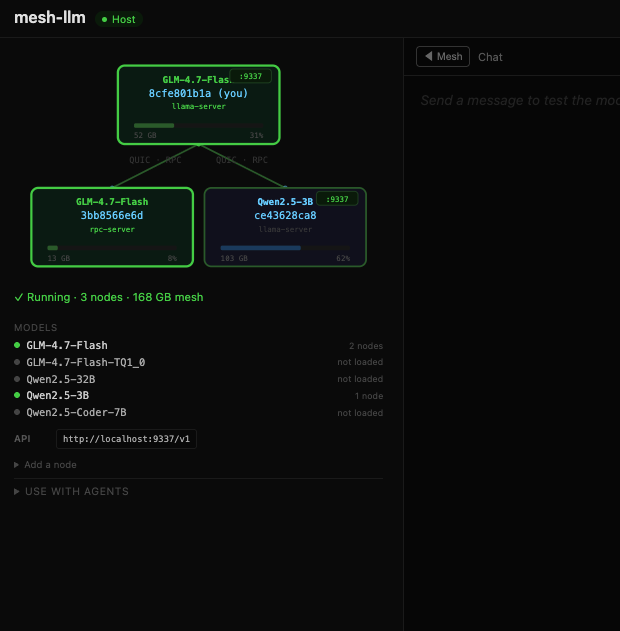

# Mesh LLM



Pool spare GPU capacity to run LLMs at larger scale. Split inference across machines over QUIC — models can be larger than any single machine's VRAM. Each node loads only its assigned layers from a local GGUF copy (zero network transfer for weights).

**[Try it now](https://mesh-llm-console.fly.dev/)** — live console connected to a public mesh. Chat with models running on real hardware.

## Quick start (macOS Apple Silicon)

```bash
curl -fsSL https://github.com/michaelneale/decentralized-inference/releases/latest/download/mesh-bundle.tar.gz | tar xz && sudo mv mesh-bundle/* /usr/local/bin/
```

```bash
mesh-llm --model Qwen2.5-32B    # downloads model (~20GB), starts API + web console
mesh-llm --model Qwen2.5-3B     # or a small model first (~2GB)
```

Add another machine:
```bash
mesh-llm --join <token>                    # token printed by the first machine
```

Or discover and join public meshes:
```bash
mesh-llm --auto                            # find and join the best mesh
mesh-llm --client --auto                   # join as API-only client (no GPU)
```

## How it works

Every node gets an OpenAI-compatible API at `http://localhost:9337/v1`.

**Solo mode** — if a model fits on one machine, it runs there. Full speed, no network overhead.

**Tensor split** — if a model doesn't fit, layers are distributed across nodes proportional to VRAM. llama-server runs on the highest-VRAM node and coordinates via RPC. Each rpc-server loads only its assigned layers from local disk. Latency-aware: peers are selected by lowest RTT first, with an 80ms hard cap — high-latency nodes stay in the mesh as API clients but don't participate in splits.

**Multi-model** — different nodes serve different models simultaneously. The API proxy peeks at the `model` field in each request and routes to the right node via QUIC tunnel. `/v1/models` lists everything available.

**Demand-aware rebalancing** — a unified demand map tracks which models the mesh wants (from `--model` flags, API requests, and gossip). Demand signals propagate infectiously across all nodes and decay naturally via TTL. Standby nodes auto-promote to serve unserved models with active demand, or rebalance when one model is significantly hotter than others. When a model loses its last server, standby nodes detect it within ~60s.

**Latency design** — the key insight is that HTTP streaming is latency-tolerant while RPC is latency-multiplied. llama-server always runs on the same box as the GPU. The mesh tunnels HTTP, so cross-network latency only affects time-to-first-token, not per-token throughput. RPC only crosses the network for tensor splits where the model physically doesn't fit on one machine.

### Network optimizations

- **Zero-transfer GGUF loading** — `SET_TENSOR_GGUF` tells rpc-server to read weights from local disk. Dropped model load from 111s → 5s.
- **RPC round-trip reduction** — cached `get_alloc_size`, skip GGUF lookups for intermediates. Per-token round-trips: 558 → 8.
- **Direct server-to-server transfers** — intermediate tensors pushed directly between rpc-servers via TCP, not relayed through the client.
- **Speculative decoding** — draft model runs locally on the host, proposes tokens verified in one batched forward pass. +38% throughput on code (75% acceptance).

## Usage

### Start a mesh
```bash
mesh-llm --model Qwen2.5-32B
```
Starts serving a model and prints an invite token. This mesh is **private** — only people you share the token with can join.

To make it **public** (discoverable by others via `--auto`):
```bash
mesh-llm --model Qwen2.5-32B --publish
```

### Join a mesh
```bash
mesh-llm --join <token>                    # join with invite token (GPU node)
mesh-llm --client --join <token>           # join as API-only client (no GPU)
```

### Named mesh (buddy mode)
```bash
mesh-llm --auto --model GLM-4.7-Flash-Q4_K_M --mesh-name "poker-night"
```
Everyone runs the same command. First person creates it, everyone else discovers "poker-night" and joins automatically. `--mesh-name` implies `--publish` — named meshes are always published to the directory.

### Auto-discover
```bash
mesh-llm --auto                            # discover, join, and serve a model
mesh-llm --client --auto                   # join as API-only client (no GPU)
mesh-llm discover                          # browse available meshes
```

### Multi-model
```bash
mesh-llm --model Qwen2.5-32B --model GLM-4.7-Flash

# Route by model name
curl localhost:9337/v1/chat/completions -d '{"model":"GLM-4.7-Flash-Q4_K_M", ...}'
```
Different nodes serve different models. The API proxy routes by the `model` field.

### Idle mode
```bash
mesh-llm                                   # no args — shows instructions + console
```
Opens a read-only console on `:3131`. Use the CLI to start or join a mesh.

## Web console

```bash
mesh-llm --model Qwen2.5-32B    # dashboard at http://localhost:3131
```

Live topology, VRAM bars per node, model picker, built-in chat. Everything comes from `/api/status` (JSON) and `/api/events` (SSE).

## Using with agents

mesh-llm exposes an OpenAI-compatible API on `localhost:9337`. Any tool that supports custom OpenAI endpoints works. `/v1/models` lists available models; the `model` field in requests routes to the right node.

### goose

```bash
GOOSE_PROVIDER=openai OPENAI_API_KEY=dummy OPENAI_HOST=http://localhost:9337 GOOSE_MODEL=GLM-4.7-Flash-Q4_K_M goose session
```

### pi

Add a `mesh` provider to `~/.pi/agent/models.json`:

```json
{
  "providers": {
    "mesh": {
      "api": "openai-completions",
      "apiKey": "dummy",
      "baseUrl": "http://localhost:9337/v1",
      "models": [
        {
          "id": "GLM-4.7-Flash-Q4_K_M",
          "name": "GLM 4.7 Flash (mesh)",
          "contextWindow": 32768,
          "maxTokens": 8192,
          "reasoning": false,
          "input": ["text"],
          "cost": { "input": 0, "output": 0, "cacheRead": 0, "cacheWrite": 0 },
          "compat": {
            "maxTokensField": "max_tokens",
            "supportsDeveloperRole": false,
            "supportsUsageInStreaming": false
          }
        }
      ]
    }
  }
}
```

Then: `pi --provider mesh --model GLM-4.7-Flash-Q4_K_M`

### opencode

```bash
OPENAI_API_KEY=dummy OPENAI_BASE_URL=http://localhost:9337/v1 opencode -m openai/GLM-4.7-Flash-Q4_K_M
```

### claude code

Claude Code uses Anthropic's API format, not OpenAI. Community proxies translate between the two:

```bash
# Using claude-code-proxy (github.com/1rgs/claude-code-proxy)
ANTHROPIC_BASE_URL=http://localhost:8082 claude
```

See [claude-code-proxy](https://github.com/1rgs/claude-code-proxy) or [litellm](https://docs.litellm.ai/docs/tutorials/claude_responses_api) for setup.

### curl / any OpenAI client

```bash
curl http://localhost:9337/v1/chat/completions \
  -H "Content-Type: application/json" \
  -d '{"model":"GLM-4.7-Flash-Q4_K_M","messages":[{"role":"user","content":"hello"}]}'
```

## Benchmarks

GLM-4.7-Flash-Q4_K_M (17GB), M4 Max + Mac Mini M4, WiFi:

| Configuration | tok/s |
|---|---|
| Solo (no mesh) | 68 |
| 2-node split (85/15) | 21 |
| 3-node split (62/31/8) | 12-13 |

Cross-network (Sydney ↔ Queensland, ~20ms RTT): 10-25 tok/s. Overhead dominated by per-token RPC latency.

Stock llama.cpp RPC transfers 16.88GB on connect. This fork: **0 bytes, ~9 seconds**.

## Model catalog

```bash
mesh-llm download           # list models
mesh-llm download 32b       # Qwen2.5-32B (~20GB)
mesh-llm download 72b --draft  # Qwen2.5-72B + draft model
```

Draft pairings for speculative decoding:

| Model | Size | Draft | Draft size |
|-------|------|-------|------------|
| Qwen2.5 (3B/7B/14B/32B/72B) | 2-47GB | Qwen2.5-0.5B | 491MB |
| Qwen3-32B | 20GB | Qwen3-0.6B | 397MB |
| Llama-3.3-70B | 43GB | Llama-3.2-1B | 760MB |
| Gemma-3-27B | 17GB | Gemma-3-1B | 780MB |

## CLI Reference

```
mesh-llm [OPTIONS]
  --model NAME|PATH    Model to serve (can specify multiple)
  --join TOKEN         Join mesh via invite token
  --auto               Discover and join via directory
  --client             API-only client (no GPU)
  --mesh-name NAME     Name the mesh (implies --publish)
  --publish            Publish mesh to directory
  --region REGION      Geographic region tag (AU, US-West, EU-West, ...)
  --max-clients N      Delist when N clients connected
  --port PORT          API port (default: 9337)
  --console PORT       Console port (default: 3131)
  --bind-port PORT     Pin QUIC to fixed UDP port (for NAT)
  --listen-all         Bind to 0.0.0.0 (for containers)
  --max-vram GB        Cap VRAM advertised to mesh
  --split              Force tensor split
  --device DEV         GPU device (default: MTL0)
  --draft PATH         Draft model for speculative decoding
  --no-draft           Disable auto draft detection

mesh-llm download [NAME] [--draft]
mesh-llm discover [--model M] [--region R] [--auto]
mesh-llm drop <model>
mesh-llm rotate-key
```

## Deploying

```bash
just bundle                                    # creates /tmp/mesh-bundle.tar.gz
scp /tmp/mesh-bundle.tar.gz user@remote:
ssh user@remote 'tar xzf mesh-bundle.tar.gz && mesh-bundle/mesh-llm --model Qwen2.5-3B'
```

Same architecture required (arm64 macOS → arm64 macOS). Bundle includes mesh-llm + llama.cpp binaries. For WAN: forward `--bind-port` UDP on the router — only the originator needs it.

## Building

```bash
just build            # clones llama.cpp fork, builds everything
just bundle           # portable tarball
```

## Project Structure

| Path | Purpose |
|---|---|
| `llama.cpp/` | [Fork](https://github.com/michaelneale/llama.cpp/tree/rpc-local-gguf) with zero-transfer RPC patches |
| `mesh-llm/` | Rust QUIC mesh ([internals](mesh-llm/README.md)) |

## [Roadmap](ROADMAP.md)
