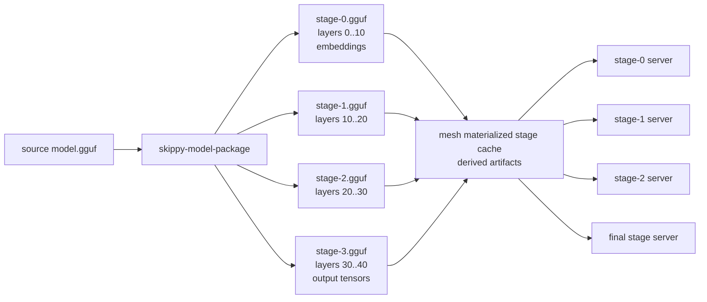

# skippy-model-package

Model inspection and stage-package CLI.

This tool uses llama-backed model introspection through the C ABI. GGUF writing
must go through llama.cpp writer code exposed by the ABI; Rust owns package
planning, manifests, checksums, and CLI behavior.

## Architecture Role

`skippy-model-package` prepares the per-stage model artifacts consumed by
`skippy-server` through the mesh materialization cache. Each stage owns one
contiguous layer range and loads a sparse GGUF shard or a materialized package
slice:



Mesh treats these generated shards as derived cache. Package-backed models use
stable Hugging Face identity from `model-ref`/`model-hf`; direct local GGUFs are
materialized as synthetic package inputs instead of using the path stem as a
model id.

## Commands

```bash
skippy-model-package inspect model.gguf
skippy-model-package plan model.gguf --stages 4
skippy-model-package write model.gguf --layers 0..12 --out stage-0.gguf --manifest stage-0.json
skippy-model-package write-stages model.gguf --stages 4 --out-dir slices/
skippy-model-package write-package org/repo:Q4_K_M --out-dir model-package/
skippy-model-package write-package org/repo:Q4_K_M --projector mmproj-model-f16.gguf --out-dir model-package/
skippy-model-package validate model.gguf slices/stage-*.gguf
skippy-model-package validate-package model.gguf model-package/
skippy-model-package validate-glm-dsa-contract model-package/
```

`write` and `write-stages` call the llama C ABI, which uses llama.cpp GGUF
writer code for artifact metadata and streams selected tensor bytes from the
source model. The Rust CLI owns planning, manifests, file checksums, and
validation reports.

`validate` checks that every owned tensor from the source model appears exactly
once across the supplied artifact slices, with no unknown tensors and no
duplicate owned tensors. Shared metadata and tokenizer KVs are preserved by the
llama-backed writer.

`write-package` prefers model coordinates such as `org/repo:Q4_K_M`. It resolves
the coordinate through `model-ref`, `model-artifact`, and the `huggingface-hub`
backed `model-hf` adapter, downloads the resolved source artifact, and records
the resolved repo, revision, primary file, canonical ref, distribution id, and
artifact file set in `model-package.json`.

### Package v2 writer (development branch)

`write-package` emits the shared `skippy-package-format` schema v2. It captures
all source GGUF directories and native stored sizes before writing, copies whole
source shards into generic `artifacts/source-NNNNN.gguf` containers, reopens each
copy, and compares exact names, types, dimensions, absolute offsets, lengths,
alignment and file SHA-256 against that independent inventory. Padding is not
counted as tensor storage. Shard counts and total tensors are checked against
GGUF split metadata; duplicate source names and missing source files fail closed.
No stage count, tensor role, endpoint, or tensor-name predicate selects content.

Whole-shard copying preserves the original typed model and tokenizer metadata;
the manifest also records the decoded metadata map. This first writer unit does
not optimize physical grouping into per-layer files. Layer ordinals are absent
because GGUF directories do not contain a structural per-tensor layer field;
the native inspector's name-derived layer index is deliberately not reused.

The catalog supports explicit storage aliases. The pinned native GGUF inspector
currently rejects shared-offset tensor directories, so such sources are rejected
rather than silently expanded or certified. Ingesting those sources requires a
separate native inspection change. Equal bytes in distinct source allocations
are **not** aliases.

Pass `--projector path/to/mmproj*.gguf` to copy and verify explicit projector
sidecars. This writer does not infer generation policy/defaults from tensor names
or implement offline conversion. The existing `plan`, `write`, `write-stages`,
`validate`, `validate-package`, `preflight`, and GLM-DSA commands still serve their
existing slice/v1 contracts; they are not v2 certification or serving paths.
Runtime admission, metadata-graph certification and atomic serving cutover remain
separate integration work. Do not publish these packages for the current v1 runtime.

Local paths are only accepted for package creation when the caller supplies
explicit provenance:

```bash
skippy-model-package write-package ./model.gguf \
  --out-dir model-package/ \
  --model-id org/repo:Q4_K_M \
  --source-revision abc123 \
  --source-file Qwen3-8B-Q4_K_M.gguf
```

This keeps canonical package identity tied to real model coordinates rather
than inferred from arbitrary filesystem paths.

V2 creation rejects `--transform-artifact-command`: perform conversion or
quantization on the independent source before packaging. It must not redefine the
expected inventory from transformed or incomplete output.
`--after-artifact-command` runs only after an artifact passes exact source checks;
as before, an upload hook may delete that verified local copy. If it leaves a copy,
that copy is checked again. Remote upload verification remains the hook's duty.
`--resume-existing-artifacts` verifies existing copies against the original source
before reuse; source files remain mandatory. An existing `model-package.json` is
never overwritten; use a new output directory. The manifest completion marker is
written only after all artifact checks succeed.

`validate-glm-dsa-contract` is the local pre-spend gate for GLM-5.2-style
artifacts. It checks GGUF metadata, tensor completeness, native MTP
preservation, and Full/Shared IndexShare roles. New GLM-DSA artifacts must
expose roles through `glm-dsa.attention.indexer.types` or frequency/offset
metadata; tensor-presence inference is reported as a compatibility fallback
and fails the contract gate.
