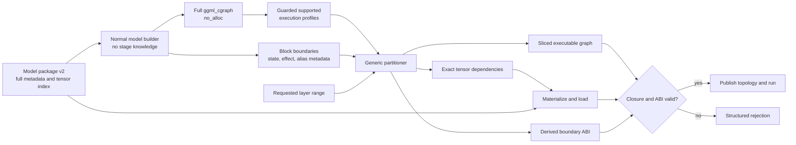

# Generic Skippy Graph-Derived Stage Splitting Plan

Status: proposed for sign-off.

## Decision Request

Approve replacing Skippy's three independent descriptions of a stage with one
graph-derived stage plan:

1. Build the normal unsplit `ggml_cgraph` in metadata-only mode.
2. Partition it using generic, stage-independent block and state metadata.
3. Derive the executable node set, exact tensor dependency closure, activation
   boundary, and state ownership from that partition.
4. Load only the derived tensor set from a new model-package format.
5. Validate the realized stage before topology publication.

No model family names, architecture enums, tensor-name heuristics, or mutable
filtering diagnostics may participate in stage selection.

## Problem Statement

Today the same `[layer_start, layer_end)` request is interpreted independently
by three systems:

- package planning chooses artifacts using layer, role, endpoint, and name
  heuristics;
- native loading filters tensors using coarse ownership classes and family
  exceptions;
- model builders contain copied stage-range, activation-input, output, and
  early-return branches.

Correctness depends on all three interpretations agreeing. Granite exposed one
generic failure mode: mutable loader state suppressed separate Q/K/V weights
while the graph still referenced them. Other families can diverge through
shared weights, experts, recurrent state, sidebands, hyper-connections, tied
outputs, or optional execution paths.

## Proposed Design Invariants

These invariants are non-negotiable implementation gates:

1. **One computation graph.** Reuse the actual `ggml_cgraph`; do not create a
   parallel model IR that can drift from execution.
2. **No stage-aware model builders.** Builders construct their normal unsplit
   computation. They never receive a stage range and never choose stage input,
   output, or weight ownership.
3. **Stage-independent annotations only.** Builders or common graph helpers may
   register block input/output, layer ordinal, aliases, and persistent-state
   effects because those are properties of the unsplit computation.
4. **No model-aware splitter.** The partitioner cannot inspect family names,
   architecture enums, tensor names, fused/separate projection types, or
   model-specific flags.
5. **Exact dependency closure.** Every parameter referenced by a retained op is
   loaded exactly once with matching identity, dtype, and shape.
6. **Effects are dependencies.** KV/recurrent reads and writes, aliases,
   ordering constraints, and lifetimes participate in the slice closure.
7. **Boundaries preserve frontier liveness.** Activation and state planes are
   derived from values live across each selected block frontier, not declared
   by family policy. A value that skips an intermediate stage remains a typed
   pass-through import and export even when that stage does not consume it.
8. **Persistent state stays local.** KV or recurrent state remains owned by the
   stage executing the relevant layers unless a real graph edge crosses the
   cut.
9. **Execution profiles remain guarded.** Prefill, decode, batch, speculative,
   and optional paths retain separate executable slices and boundary schemas.
   Only their resident weight requirements are conservatively unioned. A
   single traced shape or one merged executable graph cannot certify a stage.
10. **Legal cuts are derived.** A numbered layer boundary is not automatically
    legal. Unsupported boundaries fail closed with a structured reason.
11. **Validation precedes publication.** No partial or inconsistent stage is
    advertised to the topology.
12. **Deterministic planning.** The same package identity, graph/planner
    semantic version, graph-affecting configuration, runtime profile, and
    requested range produce the same normalized plan and digest independent of
    tensor-probe order.

## Target Data Flow



## Workstream 0: Baseline and Ownership

- Treat Astrid's immediate QKV correction as a separate correctness fix; do not
  duplicate or block it in this structural project.
- Start the structural work from the integration commit containing the current
  staged-runtime behavior and the immediate correctness fix.
- Record exact baseline commits for Mesh and the prepared llama.cpp tree.
- Capture current package corpus identities, supported-family registry, stage
  protocol generation, and end-to-end parity results.
- Freeze an expected support matrix before enabling the new planner. It records
  every certified model profile, required lane, currently supported cut, and
  capability obligation independently of what the new partitioner later
  chooses to accept or reject.
- Use a dedicated worktree. Do not modify the default branch.

**Exit gate:** reproducible baseline, independently frozen expected support
matrix, and no ambiguous ownership with the Granite fix or activation-plane
work.

## Workstream 1: Package Format v2

Create a new package format and make it the only accepted format for the new
runtime path. Do not add long-lived v1 runtime compatibility.

### Manifest contents

- package schema version and immutable package identity;
- source model identity and complete model hyperparameter metadata required for
  `no_alloc` graph construction;
- artifact table: stable artifact id, path/reference, byte size, and SHA-256;
- tensor table with one entry per source tensor:
  - stable tensor identity/name;
  - dtype and complete dimensions;
  - optional stage-independent layer ordinal used for physical organization and
    diagnostics, never for dependency correctness;
  - artifact id, data offset, stored length, alignment, and tensor checksum or
    artifact-bound integrity proof;
- tokenizer, projector, and generation-sidecar identities where applicable;
- Skippy native ABI requirements and package-generator version.

### Physical layout

- Per-layer GGUF artifacts may remain because they are efficient physical
  containers.
- Replace semantic `embeddings` and `output` ownership assumptions with generic
  shared artifacts. Physical grouping cannot decide stage ownership.
- Every source tensor appears exactly once in the catalog unless an explicit
  alias record proves shared storage.
- Package creation is independent of stage count and cut locations.

### Creation and validation

- Generate artifacts and the catalog from the same source inventory.
- Re-open written artifacts and compare exact tensor identity, dtype, shape,
  offsets, and integrity—not only tensor count and aggregate bytes.
- Build the metadata-only unsplit graph from the package catalog as a package
  certification step.
- Reject missing, duplicate, mismatched, overlapping, or out-of-bounds tensor
  records.
- Provide an optional offline v1-to-v2 converter. Existing v1 artifacts prove
  only what survived old package selection, not what the source model
  contained. The converter may certify full coverage only by comparing against
  the original source tensor directories or an immutable, source-bound tensor
  inventory captured independently of v1 selection. Without that independent
  expected set it must refuse certification and require a rebuild.

**Exit gate:** v2 packages can reconstruct the full metadata model without
reading weight payloads, and the current certification corpus has been rebuilt
or converted only where independent source evidence proves full coverage.

## Workstream 2: Metadata-Only Unsplit Graph

- Prototype the existing llama.cpp `no_alloc` path against representative
  models. Prove that it creates all required tensor handles without reading or
  allocating weight payloads.
- Build the exact normal graph used for execution rather than a second model
  description.
- Remove the stage filter from planning builds; every model builder emits its
  unsplit computation.
- Add a planning profile matrix covering at minimum:
  - prompt prefill;
  - single-token decode;
  - multi-sequence/batched execution;
  - enabled speculative/MTP paths;
  - enabled multimodal or other optional paths that affect the language graph.
- Normalize each admitted execution profile separately. Preserve its own
  executable slice, guards, and boundary schema; union only exact parameter
  requirements needed for the shared resident weight set.
- Bind admitted profiles to graph/planner semantics and all graph-affecting
  configuration. Every subsequently built runtime graph must match an admitted
  contract before execution; a new configuration either replans or rejects.
- Reject unstable or unexplained shape-dependent tensor closures.
- Measure planning time and metadata memory. Assert that no full-model weight
  allocation or KV allocation occurs merely to plan.

**Exit gate:** the same executable graph machinery builds in metadata-only mode,
produces a real slice, binds only selected weights, and completes prompt prefill
plus multiple decode steps for dense and stateful fixtures, with bounded
planning resources and no unselected weight payload reads.

## Workstream 3: Generic Graph Semantics

Extend the executable graph with only the semantics required for a correct
partition. Do not encode staging policy.

### Block structure

- Register a canonical input and output boundary for every transformer or
  recurrent block with its layer ordinal.
- Prefer common builder/context helpers such as `begin_block` / `end_block`.
  Model-file edits may be mechanical registration only.
- Add a validation/lint gate: every declared layer has exactly one ordered block
  entry and exit for each supported graph profile.
- Do not infer block boundaries from node names.

### Parameters and aliases

- Classify every graph leaf explicitly as a catalog parameter, request input,
  persistent state, or activation import. Do not infer a leaf class from where
  its tensor was created.
- Identify parameter leaves by stable catalog identity.
- Preserve view/base relationships and storage aliases.
- Ensure an alias cannot make an unloaded base allocation reachable.
- Define request-input bindings for token ids, positions, masks, and equivalent
  invocation data so they cannot be mistaken for activation planes or weights.

### Effects and persistent state

- Represent KV/recurrent state reads, writes, and ordering dependencies in the
  graph or in a side table owned by that exact `ggml_cgraph`.
- Attach each persistent state component to its stage-independent layer owner.
- Distinguish persistent local state from values that genuinely cross a stage
  boundary.
- Reject any family whose necessary state remains invisible to the planner.

**Exit gate:** generic metadata fully describes block frontiers, parameters,
aliases, and effects for the fixture set. No family-specific splitter code is
introduced.

## Workstream 4: Pure Graph Partitioner

Implement the partitioner as a deterministic pure function of:

```text
(normalized graph profiles, package tensor catalog, requested range,
 runtime capabilities) -> StageSlicePlan | UnsupportedStage
```

### Algorithm

1. Resolve the requested start and end to registered block frontiers.
2. Classify every graph leaf as parameter, request input, persistent state, or
   activation value before computing a boundary.
3. Compute graph-wide value liveness at every registered frontier for each
   admitted execution profile.
4. Retain computation from the start frontier through the end frontier.
5. Preserve all effect nodes, ordering edges, alias bases, and lifetimes needed
   by the retained computation.
6. Import every activation value live at the start frontier. Export every
   activation value live at the end frontier, including an imported value that
   the stage merely forwards to a later consumer. Preserve semantic identity
   across pass-through planes.
7. Resolve parameters locally from the catalog, request inputs from the
   invocation contract, and persistent state from its declared owner; none may
   be reclassified as an upstream activation.
8. Walk the retained graph to derive exact parameter identities.
9. Preserve separate guarded executable slices and boundary schemas per
   profile, then union only their exact parameter identities into the resident
   weight requirement.
10. Classify persistent state ownership from registered state effects.
11. Validate that every dependency resolves exactly once in the package
    catalog.
12. Normalize and hash the plan.

### `StageSlicePlan`

- descriptor version;
- requested and realized layer range;
- legal-cut result and structured rejection reason;
- guarded per-profile executable-slice identifiers and boundary schemas;
- exact sorted tensor dependency identities and digest;
- logical parameter bytes derived from the catalog, separate from
  backend-specific allocated, aligned, repacked, and peak bytes;
- request-input bindings and typed activation pass-through relationships;
- typed input and output boundary planes;
- persistent KV/recurrent state ownership and geometry;
- supported execution profiles, sequence/batch limits, and backend constraints;
- plan digest bound to package identity, graph/planner semantic version, native
  ABI, and graph-affecting configuration.

The partitioner cannot call or depend on model-family helpers.

**Exit gate:** unit/property tests prove closure, deterministic output, complete
frontier liveness including pass-through values, guarded profile separation,
and effect preservation for valid and invalid cuts.

## Workstream 5: Exact Realization and Loading

- Resolve `StageSlicePlan.tensor_dependencies` through the v2 tensor catalog.
- Initially materialize a stage-local GGUF if that minimizes changes to the
  existing loader; direct callback/range loading can follow without changing
  the plan contract.
- During real graph construction, create metadata tensor handles for the full
  model but allocate/read payloads only for the dependency closure.
- Instantiate the executable slice from the same normalized plan used for
  loading.
- Before executing any concrete graph, verify that its profile, guards,
  boundary schema, parameter references, effects, and configuration match the
  admitted plan. Replan or reject on mismatch.
- Make representation selection structural: the unsplit graph references fused
  QKV or separate Q/K/V according to what exists; the loader never makes that
  choice.
- Return the realized descriptor through the native ABI.
- Before topology publication, verify:
  - every retained op operand is resolved;
  - every loaded tensor is in the closure;
  - no closure tensor is absent;
  - dtype, shape, alias, and backend placement match;
  - catalog-derived logical parameter bytes match the dependency closure while
    physical and peak backend allocations are reported separately;
  - input/output plane descriptors match neighboring stages;
  - state ownership and supported operations are complete.
- Fail with a structured `UnsupportedStage` / `InvalidPackage` error, never an
  assertion or null operand during graph execution.

**Exit gate:** load-time tensor identity exactly equals planned closure and all
negative fixtures fail before topology publication.

## Workstream 6: Protocol and ABI

### Native ABI

- Add a versioned realized-stage descriptor carrying the normalized
  `StageSlicePlan` fields needed by the host.
- Prefer additive ABI entry points during development; remove obsolete
  stage-filter APIs only at final cutover.

### Network protocol

- Do not block the internal design on a wire change.
- Continue stage protocol generation 7 when the derived boundary is exactly
  representable as the current single raw-F32 activation plus supported flags.
- Fail closed when a derived boundary cannot be represented by generation 7.
- In a separate reviewed workstream, add a negotiated protocol generation for
  typed activation bundles:
  - repeated plane descriptors with stable semantic ids;
  - dtype, layout, dimensions/strides, byte offset, and byte length;
  - bounded payload framing and integrity validation;
  - exact producer/consumer descriptor matching.
- Preserve mixed-version meshes through capability negotiation until a
  coordinated protocol cutoff is explicitly approved. This is required by
  repository policy even though package v1 compatibility is intentionally not
  retained.
- The transport workstream may proceed independently, but it must land before
  graph-filter-v2 cutover if the frozen expected support matrix contains any
  required model or cut whose boundary generation 7 cannot represent. Reduced
  support requires an explicit, separately reviewed product decision.

**Exit gate:** current single-plane models run unchanged on generation 7;
multi-plane obligations in the frozen support matrix are negotiated correctly
before cutover, and other unsupported boundaries reject before topology
publication.

## Workstream 7: Migration and Deletion

Use a shadow-first migration so the old path can be compared, then deleted.

1. Add the new planner behind a development-only switch.
2. In shadow mode, build the current stage and independently compute the new
   plan. Compare exact tensor identities, realized boundaries, state ownership,
   and logical bytes without changing execution. Treat this comparison as a
   migration diagnostic; unsplit numerical execution remains the correctness
   oracle, and old over-retention or bugs are not compatibility requirements.
3. Enable execution from the new plan for compact dense fixtures.
4. Expand to fused-QKV, separate-QKV, MoE/shared-weight, hybrid/recurrent,
   hyper-connected, sideband, MTP, and multimodal fixtures.
5. Run the full registry canary and every-cut certification.
6. Rebuild or convert the production package corpus to v2.
7. Land typed boundary transport first if any frozen baseline obligation cannot
   be represented by generation 7.
8. Atomically cut over the runtime to v2 plus graph-derived planning.
9. Delete:
   - thread-local and mutable stage-filter diagnostics;
   - loader family retention branches;
   - package role/name stage-selection policy;
   - stage-range branches and stage-boundary early returns from model builders;
   - development shadow mode and v1 package acceptance.

Rollback is by reverting to the previous binary and v1 package corpus, not by
shipping two permanent runtime implementations.

**Exit gate:** searches over the splitter, loader, package planner, and model
builders find no model-family staging policy and no stage-filter control flow.

## Workstream 8: Verification Matrix

### Pure partitioner tests

- first, middle, final, single-layer, and invalid cuts;
- parameter-free ops at boundaries;
- residual, skip, fan-out, and alias edges;
- a three-stage skip or sideband edge whose value passes through a middle stage
  without being consumed there; every two-stage cut alone is insufficient;
- effect-only KV/recurrent writes;
- deterministic output under tensor and node enumeration changes;
- separate guarded prefill/decode/batch/optional slices with a shared
  conservative parameter union;
- unsupported hidden state and unrepresentable boundary failures.

### Package tests

- exact full-source tensor coverage;
- missing, duplicate, mismatched dtype/shape, corrupt offset, alias, and checksum
  failures;
- v1 rejection with an actionable conversion command;
- v1-to-v2 conversion success only when an independent source inventory proves
  the package complete;
- refusal when only the selected v1 artifacts are available as the expected
  tensor set;
- no weight payload reads during metadata planning.

### Native/runtime integration fixtures

- dense separate-QKV model, including Granite or Granite-Hybrid;
- fused-QKV model;
- MoE and shared-expert model;
- recurrent and hybrid model with persistent state;
- sideband/hyper-connected model;
- MTP/speculative path;
- multimodal language path where it changes graph dependencies.

For every legal cut:

- package load succeeds;
- one prompt prefill succeeds;
- multiple decode steps succeed;
- split and unsplit logits/selected tokens satisfy the existing correctness
  tolerance;
- neighboring boundary descriptors match exactly;
- planned dependency identities equal loaded identities;
- logical parameter bytes equal the catalog sum while backend physical and peak
  allocation measurements are reported independently;
- state export/import and prefix-cache behavior remain correct where supported;
- three-or-more-stage composition preserves live pass-through values and state
  lifecycle across adjacent boundaries.

Run the same behavioral matrix through direct GGUF, callback/SafeTensors, and
model-package v2 sources where those paths are supported.

### Mic Studio full-registry acceptance gate

Final acceptance requires an explicit `manual-full` llama canary run on the
trusted Mic Studio `family-certify` runner. The accepted model count is not a
number copied into this document: it is the complete set of certified model
profiles generated from `ci/model-artifacts/registry.json` into
`ci/llama-canary/family-certified.json` at the candidate commit. That set is 33
profiles when this plan is written, and it may grow before implementation
lands.

The acceptance plan must be immutable and digest-bound to the candidate source
commit, package-v2 corpus, llama.cpp pin, generated family policy, frozen
expected support matrix, graph/planner semantic version, and graph-affecting
configuration. For every selected model profile, Mic Studio must:

- create or validate its v2 package and exact tensor catalog;
- build the metadata-only unsplit execution profiles used for planning;
- derive legal cuts generically, then prove that the result retains every cut
  and capability obligation in the independently frozen support matrix;
- execute every derived legal cut through package load, prompt prefill,
  multiple decode steps, and split/unsplit correctness comparison;
- exercise state handoff, cache behavior, MTP/speculative, multimodal, and
  typed sideband behavior whenever the profile declares those capabilities;
- retain the existing required `single-step`, `chain`, and `state-handoff`
  lanes as compatibility evidence while the every-cut lane is added;
- use unsplit numerical execution as the correctness oracle and include
  multi-stage composition plus persistent-state lifecycle coverage.

The canary must reconcile the frozen support matrix, derived plan, and execution
by exact model identity, profile, cut, capability, and required lane. Missing,
skipped, duplicate, unplanned, newly rejected baseline, or incomplete results
are failures; a green subset is not acceptance. Every currently certified model
must expose and pass the stage placements it already supports. A model that
derives no usable cut, loses an existing supported cut, or requires an
unrepresentable boundary blocks completion unless its supported status is
changed through a separately reviewed product decision.

Upload the plan, plan digest, runner identity, immutable model manifests,
package-v2 manifests, frozen support matrix, per-cut outcomes,
dependency-closure comparisons, boundary descriptors, and logs even when the
run fails. The bounded nightly cadence remains useful for routine detection,
but it cannot substitute for this full-registry Mic Studio acceptance run.

### Required repository validation

- full tests for every touched Rust package, never module-scoped substitutes;
- native llama.cpp staged-runtime tests and patch-application checks;
- `cargo test -p skippy-ffi --lib` and `cargo test -p skippy-runtime --lib` for
  ABI changes;
- `cargo test -p skippy-protocol --lib` and
  `cargo test -p mesh-llm-host-runtime --lib` for protocol/control changes;
- real two-node inference for user-visible integration behavior;
- mixed-version node validation whenever the network protocol changes;
- upstream llama.cpp pin/canary validation across the supported registry;
- one green, exactly reconciled Mic Studio full-registry acceptance run at the
  candidate commit.

## Implementation Ownership

Use five implementation lanes with one integration owner. These are ownership
boundaries, not separate architectural authorities: all lanes implement the
same three early shared contracts—`TensorCatalog`, guarded `StageSlicePlan`, and
boundary identity/schema.

| Lane | Deliverable | Dependency |
| --- | --- | --- |
| A. Native graph contract and partitioner | Workstreams 2–4: end-to-end feasibility proof, block/effect/alias annotations, guarded profiles, complete frontier liveness, and the pure partitioner | Critical path. Keep annotations and slicing under one design owner until their contract is proven. |
| B. Package v2 and conversion | Workstream 1: catalog/schema, writer/reader, independent source-inventory proof, integrity checks, and malformed-package tests | Schema work can begin with A and implementation can proceed independently after the minimal catalog contract is agreed. |
| C. Realization and host admission | Workstream 5 plus the native ABI portion of Workstream 6: selected-weight allocation, runtime contract checks, realized descriptor/FFI, neighboring-stage validation, and readiness | May scaffold against contract fixtures; integration requires A and B. Native reports local facts and the host validates composed topology. |
| D. Independent acceptance harness | Workstreams 0 and 8: frozen support baseline, complete Mic Studio roster, plan/execution reconciliation, unsplit oracle, multi-stage/state/negative tests, and resource evidence | Baseline and harness work can start with A. Final acceptance consumes A, B, C, and E where required. The expected-support set must remain independent of planner rejection results. |
| E. Boundary transport | Network portion of Workstream 6: generation-7 representability, typed bundles, semantic ids, shape constraints, bounded framing, and negotiation | Proceeds after boundary-contract agreement and coordinates with existing activation-plane work. Required before cutover for any baseline obligation that needs it. |

The integration owner owns Workstream 7, serializes shared llama.cpp patch-queue
changes, and prevents lane-local adapters from becoming competing sources of
stage policy.

## Delivery Sequence

Deliver as reviewable, independently gated changes rather than one giant patch:

1. Lane A proves metadata build, actual slice, selected-weight binding, prompt
   prefill, and multiple decode steps for dense and stateful fixtures.
2. Agree the `TensorCatalog`, guarded `StageSlicePlan`, and boundary
   identity/schema contracts.
3. Run lanes B, D, and E in parallel where their agreed contracts allow.
4. Complete Lane A graph semantics and partitioner implementation.
5. Lane C integrates exact realization, native reporting, and host admission.
6. Run shadow diagnostics without treating old behavior as the oracle.
7. Complete cross-family execution rollout, every-cut certification, and the
   full Mic Studio acceptance run.
8. Rebuild or independently certify and convert the production package corpus.
9. Land Lane E before cutover when any frozen baseline boundary requires it.
10. The integration owner deletes the old stage filter and family policy, then
    performs the v2-only cutover.

Each change must state its base commit, tests, observed fixture coverage, and
whether it changes package, native ABI, or network compatibility.

## Completion Criteria

The project is complete only when all of the following are true:

- package v2 is the production package format and the active corpus is
  available in v2;
- model builders contain no stage ranges, endpoint ownership, or stage early
  returns;
- package planning and native loading contain no family-name or tensor-name
  stage-retention rules;
- the executable graph, tensor closure, boundary ABI, and persistent-state
  ownership all come from one normalized partition result;
- every concrete runtime graph matches a guarded admitted profile or triggers
  deterministic replanning/rejection before execution;
- every supported model passes every legal cut through load, prefill, and
  multiple decode steps;
- every cut and capability in the independently frozen support matrix remains
  supported unless a separate product decision explicitly removes it;
- three-or-more-stage composition preserves pass-through values and persistent
  state lifecycle;
- the candidate commit has a green Mic Studio canary result covering every
  certified model profile in the generated full-registry plan, with no missing,
  skipped, duplicate, unplanned, or incomplete model/cut/lane result;
- unsupported models/cuts fail before topology publication with structured
  reasons;
- planning reads metadata only and does not allocate full-model weights or KV;
- current generation-7 boundaries remain operational, and any typed-plane
  generation required by the frozen support matrix lands before cutover with
  explicit compatibility evidence;
- old staging implementation, development flags, and v1 runtime compatibility
  have been removed.

## Non-Goals

- arbitrary cuts inside a transformer/recurrent block;
- tensor, expert, or pipeline parallelism within a single block;
- changing quantization formats;
- changing topology optimization or device-placement policy beyond consuming
  accurate resident-byte and capability descriptors;
- using family certification fixtures as runtime family allowlists.

## Principal Risks and Mitigations

- **`no_alloc` is not sufficient end to end.** Prove it before designing around
  it; stop if planning still requires weight or KV allocation.
- **Graph shape changes dependencies.** Use a conservative profile union and
  reject unexplained instability, but retain separate guarded executable
  slices instead of merging profile graphs.
- **A live value disappears in an intermediate stage.** Compute liveness at
  every frontier and preserve typed pass-through identity; certify with a
  three-stage skip/sideband fixture.
- **Hidden side effects escape reachability.** Make state/effect registration a
  certification gate; do not silently accept invisible state.
- **Boundary annotation becomes staging by another name.** Limit annotations to
  unsplit block structure and effects; prohibit stage ranges and endpoint
  ownership in builders.
- **Package v2 omits legacy bytes.** Exact identity/type/shape validation against
  the source inventory prevents false certification.
- **A converter certifies its own incomplete input.** Require original source
  tensor directories or an independently captured source-bound inventory;
  otherwise rebuild.
- **Large llama.cpp patch burden.** Prefer common graph-context helpers and
  mechanical registration; keep the partitioner outside model files.
- **Protocol work expands scope.** Gate current-compatible models first and run
  typed activation planes as a separate negotiated change, but do not cut over
  while a frozen baseline obligation still depends on it.
- **Rejecting hard cases creates a false green result.** Freeze expected model,
  profile, cut, lane, and capability support before rollout and reconcile it
  independently against both planning and execution.
- **Logical and physical memory are conflated.** Use catalog bytes for logical
  closure accounting and report backend allocation, alignment, repacking, and
  peak memory separately.
- **A shadow mismatch is normalized away.** Compare exact tensor identities and
  boundary descriptors; aggregate counts are not evidence.

## Sign-Off Checklist

Approval is requested for these decisions:

- [ ] Existing `ggml_cgraph` is the sole computation representation; no second
      model IR.
- [ ] Model builders may register stage-independent block and state semantics,
      but receive no staging configuration.
- [ ] The splitter, package selector, and loader contain no model-family policy.
- [ ] Model package v2 is a deliberate hard format cutover; no permanent v1
      runtime compatibility.
- [ ] An offline converter may reuse old weight artifacts only after exact
      coverage validation against an independent source-bound inventory.
- [ ] Legal cuts are discovered and certified; not every numbered boundary is
      promised.
- [ ] Frontiers preserve every live pass-through value, and leaf classes are
      explicit rather than inferred from creation order.
- [ ] Execution profiles remain separate guarded slices; only their exact
      resident parameter requirements are unioned.
- [ ] The plan digest covers graph/planner semantics and graph-affecting
      configuration, and every runtime graph is checked against it.
- [ ] Generation-7 wire behavior remains for representable boundaries; typed
      activation planes are a separate negotiated protocol change that lands
      before cutover if a frozen baseline obligation requires it.
- [ ] Old split logic is deleted only after shadow comparison and the full
      cross-family every-cut gate passes.
- [ ] Acceptance reconciles an independently frozen support matrix so the new
      planner cannot pass by rejecting previously supported models or cuts.
- [ ] The work is split across lanes A–E with one integration owner and three
      shared contracts.

No implementation starts under this plan until these decisions are approved.

## Evidence Base

- `crates/skippy-model-package/src/plan.rs`
- `crates/skippy-model-package/src/package.rs`
- `crates/skippy-model-package/src/write.rs`
- `crates/skippy-runtime/src/package.rs`
- `crates/skippy-runtime/src/types.rs`
- `crates/skippy-protocol/proto/stage.proto`
- `crates/skippy-protocol/src/binary/types.rs`
- `third_party/llama.cpp/patches/0001-Add-staged-model-graph-and-family-support.patch`
